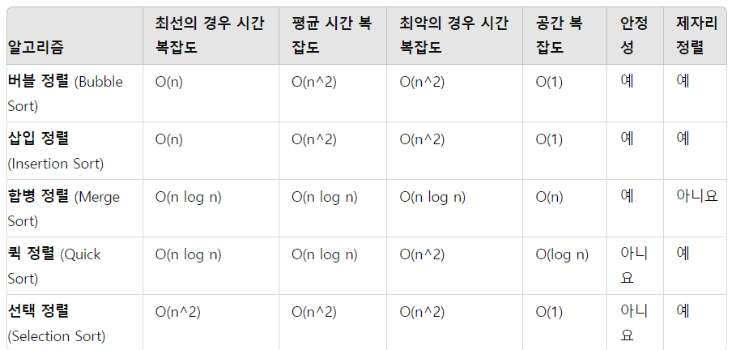

버블 정렬 (Bubble Sort)
=

최선의 경우 시간 복잡도: O(n) (리스트가 이미 정렬된 경우)

평균 시간 복잡도: O(n^2)

최악의 경우 시간 복잡도: O(n^2)

공간 복잡도: O(1) (제자리 정렬)

안정성: 예

제자리 정렬: 예

삽입 정렬 (Insertion Sort)
=

최선의 경우 시간 복잡도: O(n) (리스트가 이미 정렬된 경우)

평균 시간 복잡도: O(n^2)

최악의 경우 시간 복잡도: O(n^2)

공간 복잡도: O(1) (제자리 정렬)

안정성: 예

제자리 정렬: 예

합병 정렬 (Merge Sort)
=
최선의 경우 시간 복잡도: O(n log n)

평균 시간 복잡도: O(n log n)

최악의 경우 시간 복잡도: O(n log n)

공간 복잡도: O(n) (추가적인 메모리 사용)

안정성: 예

제자리 정렬: 아니요

퀵 정렬 (Quick Sort)
=
최선의 경우 시간 복잡도: O(n log n)

평균 시간 복잡도: O(n log n)

최악의 경우 시간 복잡도: O(n^2) (피벗이 계속 리스트의 최대 또는 최소 요소를 선택할 때 발생)

공간 복잡도: O(log n) (재귀 호출 스택에 의해 사용되는 공간)

안정성: 아니요

제자리 정렬: 예

선택 정렬 (Selection Sort)
=
최선의 경우 시간 복잡도: O(n^2)

평균 시간 복잡도: O(n^2)

최악의 경우 시간 복잡도: O(n^2)

공간 복잡도: O(1) (제자리 정렬)

안정성: 아니요

제자리 정렬: 예